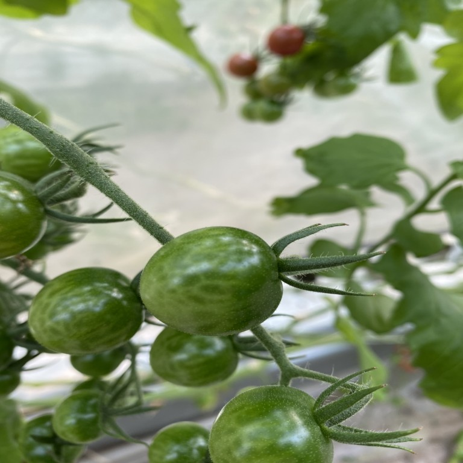
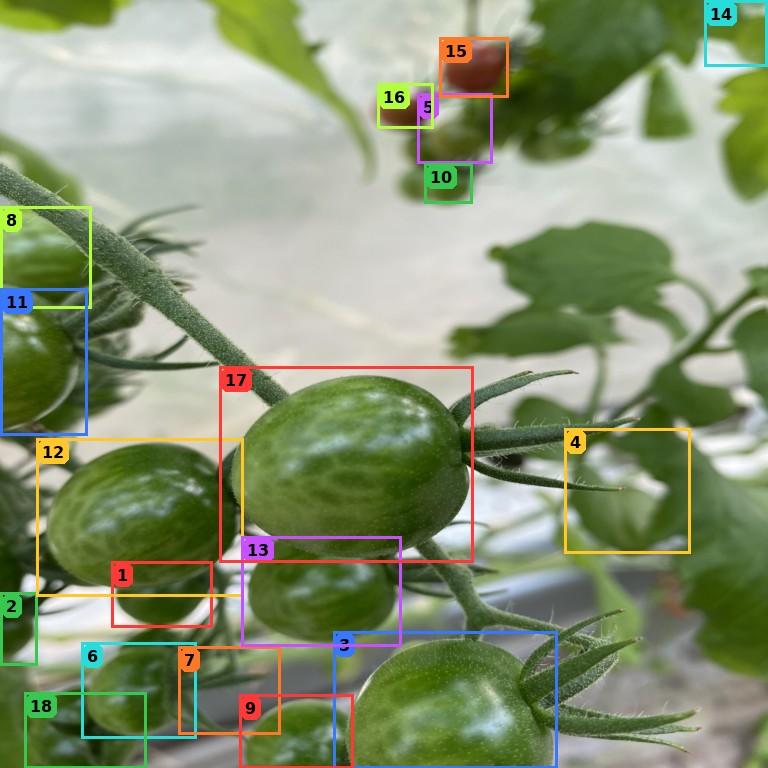
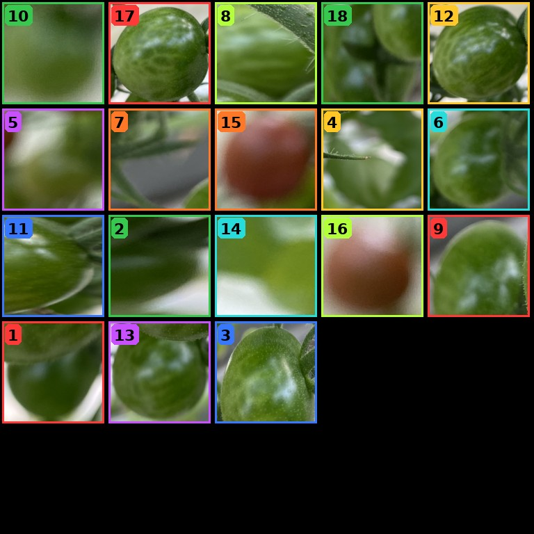
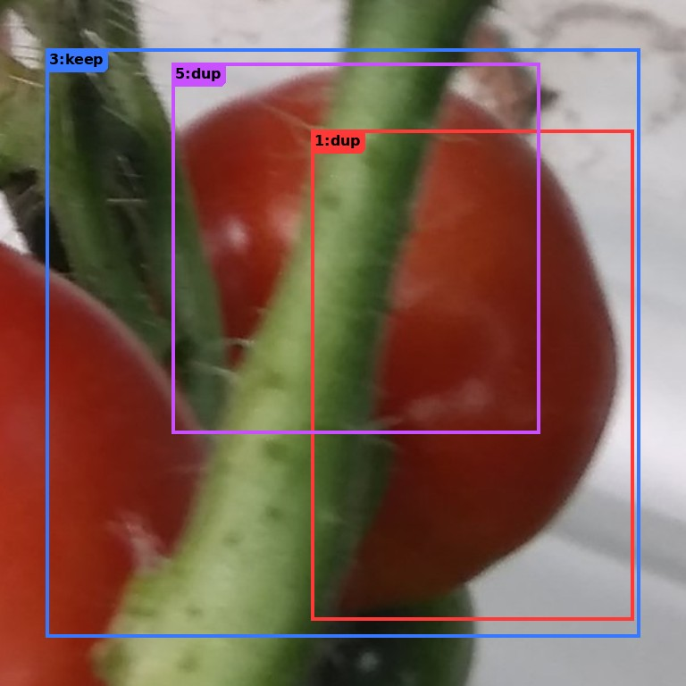
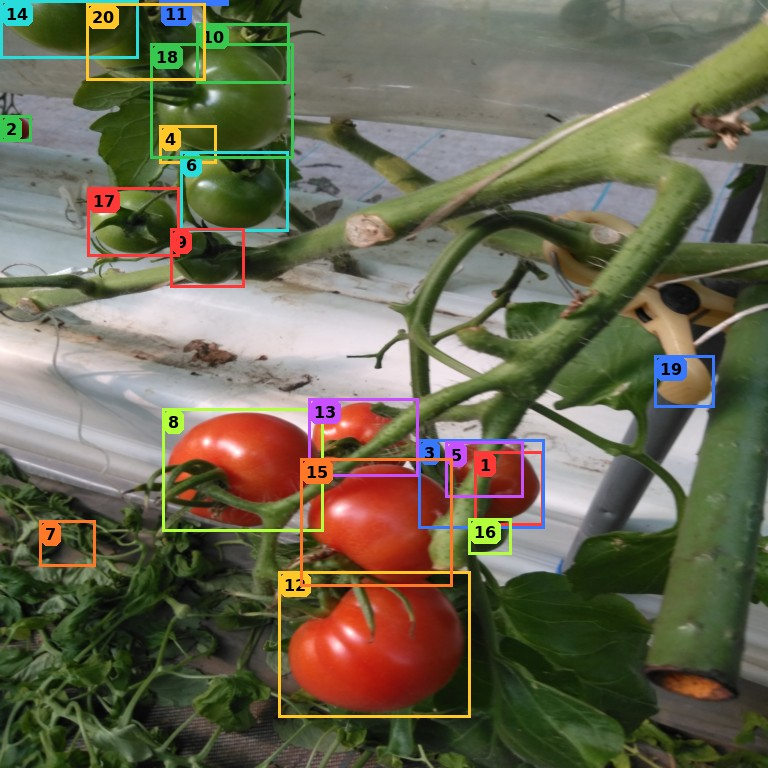
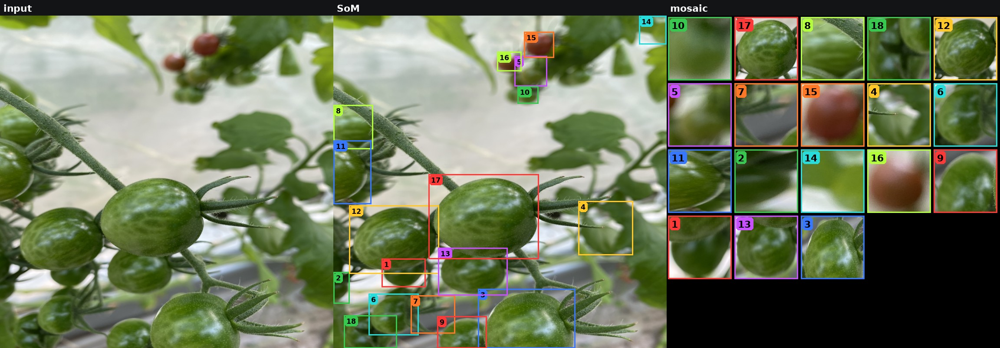
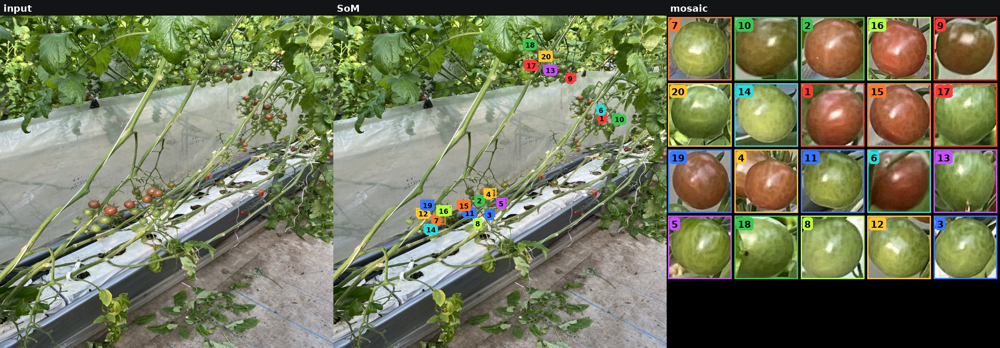
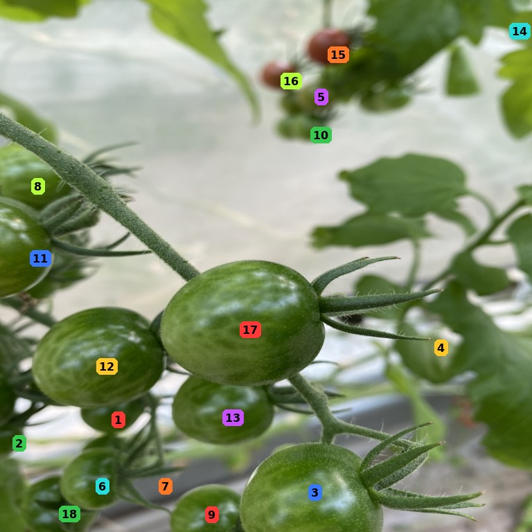

# Tutorial

재현·확장은 이 문서를 **참고**해서 하면 된다. 숫자를 외울 필요는 없고, 입력·라벨·VQA·inference 제약을 기준으로 다음 실험을 짜면 된다.

---

## 1. Qwen input

한 턴 user content = 이미지 2장 + 텍스트. GT 박스는 넣지 않는다. 박스는 YOLO 1cls @ conf 0.1, 최대 20.

```638:643:som_common.py
def som_user_content(som, mosaic, extra=""):
    return [
        {"type": "image", "image": som},
        {"type": "image", "image": mosaic},
        {"type": "text", "text": extra or PROMPT_ALL},
    ]
```

| 슬롯 | 무엇 | 역할 |
|---|---|---|
| Image 1 | SoM | 원본 + 색 박스 + 번호. 가림·중복·상대 크기 |
| Image 2 | mosaic | 크롭 격자. **칸 순서는 shuffle**, 숫자로만 매칭. 껍질 색 |
| text | prompt + `size_note` | JSON only. 마크별 면적/이미지 |

원본 / SoM / mosaic:







**ICL은 optional.** `--icl`로 켠다. little 32장에서는 zeroshot이 ICL보다 나았다 (아래 표). 예시 라벨을 그대로 복사하는 부작용이 있다. 기본 추론은 ICL 없이 쿼리 한 턴만 넣는다.

---

## 2. SFT / RL label

맞출 대상은 **YOLO 박스 id → 클래스**. GT는 `label_props`에서 IoU로 붙일 때만 쓴다.

| YOLO 박스 vs GT | 내부 | JSON / VQA |
|---|---|---|
| IoU≥0.5, 아직 안 쓴 GT | ripe / semi_ripe / unripe | 그대로 |
| 같은 열매에 이미 매칭 | dup | VQA `dup`. infer에선 tomato 아니면 drop |
| train GT p5보다 작음 | small | `not_tomato` |
| 그 외 | other | `not_tomato` |

위 쿼리 SoM에 대한 eval gold:

```json
{"1":"not_tomato","2":"not_tomato","3":"unripe","4":"not_tomato","5":"not_tomato",
 "6":"not_tomato","7":"not_tomato","8":"not_tomato","9":"not_tomato","10":"not_tomato",
 "11":"unripe","12":"unripe","13":"unripe","14":"not_tomato","15":"not_tomato",
 "16":"not_tomato","17":"unripe","18":"not_tomato"}
```

---

## 3. SFT / RL VQA

학습만 stage를 랜덤 샘플. 메시지 = 그 stage ICL 1장 + 쿼리. **추론은 이 4번을 돌리지 않는다** (한 JSON).

```14:16:sft_som.py
def make_msgs(item, exs, rng):
    kind, (q, a) = vqa_pair(item, rng)
    return with_icl(icl_stage(exs[:1], kind), item, text=q, answer=a)
```

### dedup — 왜 있나, 뭐가 헷갈리나

YOLO conf 0.1이면 **한 열매에 박스가 여러 개** 쌓인다. 둘 다 ripe로 내면 eval(IoU 0.5, class-wise)에서 하나는 TP, 나머지는 **같은 클래스 FP**. 맞닿은 **다른** 열매는 둘 다 `keep`이어야 한다. mosaic만 보면 둘 다 빨간 크롭이라 구분이 안 되고, SoM에서 같은 공인지 봐야 한다.

그래서 학습에 `keep`/`dup`를 따로 둔다. 아래가 실제 겹침. **3=keep** (왼쪽 열매, 박스가 헐거움), **1·5=dup** (이미 매칭된 오른쪽 열매 위의 추가 박스).





```json
{"1":"dup","2":"keep","3":"keep","4":"keep","5":"dup","6":"keep","7":"keep",
 "8":"keep","9":"keep","10":"keep","11":"keep","12":"keep","13":"keep","14":"keep",
 "15":"keep","16":"keep","17":"keep","18":"keep","19":"keep","20":"keep"}
```

### filt — `tomato` / `not_tomato`

`dup` 제외. `small`/`other` → `not_tomato`.


```json
{"1":"not_tomato","2":"not_tomato","3":"tomato","4":"not_tomato","5":"not_tomato",
 "6":"not_tomato","7":"not_tomato","8":"not_tomato","9":"not_tomato","10":"not_tomato",
 "11":"tomato","12":"tomato","13":"tomato","14":"not_tomato","15":"not_tomato",
 "16":"not_tomato","17":"tomato","18":"not_tomato"}
```

### unripe — 토마토만 `unripe` / `later`



```json
{"3":"unripe","11":"unripe","12":"unripe","13":"unripe","17":"unripe"}
```

### ripe_semi — leftover `ripe` / `semi_ripe`

쿼리가 전부 unripe면 `{"none":"ripe"}`. 아래는 leftover가 있는 ICL.



```json
{"2":"semi_ripe","4":"semi_ripe","9":"semi_ripe","15":"ripe","16":"ripe","19":"semi_ripe"}
```

---

## 4. SFT / RL method

### SFT

LoRA CE. assistant JSON만 (`labels=-100`이 프롬프트).

```624:635:som_common.py
def encode_sft(proc, messages, device):
    from qwen_vl_utils import process_vision_info
    prompt_msgs = messages[:-1]
    prompt = _apply(proc, prompt_msgs, True)
    full = _apply(proc, messages, False)
    imgs, vids = process_vision_info(messages)
    full_in = proc(text=[full], images=imgs, videos=vids, return_tensors="pt")
    prompt_in = proc(text=[prompt], images=imgs, videos=vids, return_tensors="pt")
    labels = full_in["input_ids"].clone()
    labels[:, :prompt_in["input_ids"].shape[1]] = -100
    full_in["labels"] = labels
    return {k: v.to(device) for k, v in full_in.items()}
```

### RL score

같은 VQA에서 JSON k개 샘플 (`T=1`). 키별 일치율. 파싱 실패면 0.

```706:722:som_common.py
def json_acc(gold, text):
    try:
        pred = extract_json(text)
    except Exception:
        return 0.0
    if not gold:
        return 0.0

    def nrm(x):
        return str(x).lower().replace("-", "_").strip()

    ok = 0
    for k, v in gold.items():
        p = pred.get(k, pred.get(str(k), ""))
        if nrm(p) == nrm(v):
            ok += 1
    return ok / len(gold)
```

### RL loss

```50:52:rl_som.py
        r = torch.tensor(rs, device=model.device, dtype=torch.float32)
        loss = -((r - r.mean()).detach() * torch.stack(logps)).mean()
        loss = loss + 0.5 * model(**encode_sft(proc, with_icl(icl_stage(exs[:1], kind), item, text=q, answer=a), model.device)).loss
```

\[
A_i = r_i - \bar r,\quad
L = -\mathbb{E}_i[A_i \log\pi(y_i\mid x)] + 0.5\,\mathrm{CE}(\text{gold})
\]

SFT LoRA에서 시작. k는 VRAM (4/3/2).

---

## 5. Inference

학습의 4 VQA를 **순차로 돌리지 않는다.** 전체 마크를 한 번의 generate로 분류하는 편이 맞고, VLM 호출이 1회라 **4-stage보다 대략 4배 빠르다.**

1. RGB 로드 (EXIF)
2. YOLO 1cls, conf 0.1 → ≤20 박스 (~13 ms, 3cls baseline과 비슷한 검출 비용)
3. SoM + mosaic
4. (optional) ICL 2장. 기본은 생략
5. Qwen 1회: `{"1":"ripe",...}`. `not_tomato`/`dup`/other는 버림
6. 남은 박스로 숙성도. 점수는 GT IoU 0.5

시간 (little, 32장, Qwen3-VL-4B, A100급):

| 단계 | 시간 |
|---|---|
| YOLO 1cls / 3cls | ~13 ms/img |
| Qwen 1 call (이미지 2장, no ICL) | 장당 수 초 (32장 eval 수 분) |
| + ICL 2장 | 컨텍스트 이미지 6장. 더 느림. little에선 점수도 ↓ |
| 4-stage VQA infer | generate ×4. 쓰지 않음 |

---

## 6. little 32장 결과

det IoU 0.5. VLM 쪽은 모두 YOLO 1cls @ 0.1 proposal.

| method | acc | macroF1 | ripe | semi | unripe |
|---|---|---|---|---|---|
| YOLO 3cls | 0.604 | 0.720 | 0.715 | 0.659 | 0.787 |
| YOLO 1cls + zero-shot VLM | 0.583 | 0.698 | 0.761 | 0.560 | 0.772 |
| YOLO 1cls + ICL VLM | 0.566 | 0.685 | 0.719 | 0.575 | 0.760 |
| YOLO 1cls + VLM SFT | 0.637 | 0.762 | 0.808 | 0.695 | 0.784 |
| YOLO 1cls + VLM SFT + RL | **0.670** | **0.795** | **0.840** | **0.738** | **0.806** |

---

## 7. 더 해볼 것

**박스 색 대신 숫자만.** 지금 SoM은 테두리가 열매를 가린다. 원본에 번호 뱃지만 찍는 입력을 같이 보면 된다.




모자이크는 그대로 두고 Image 1만 바꿔 비교하면 된다.
